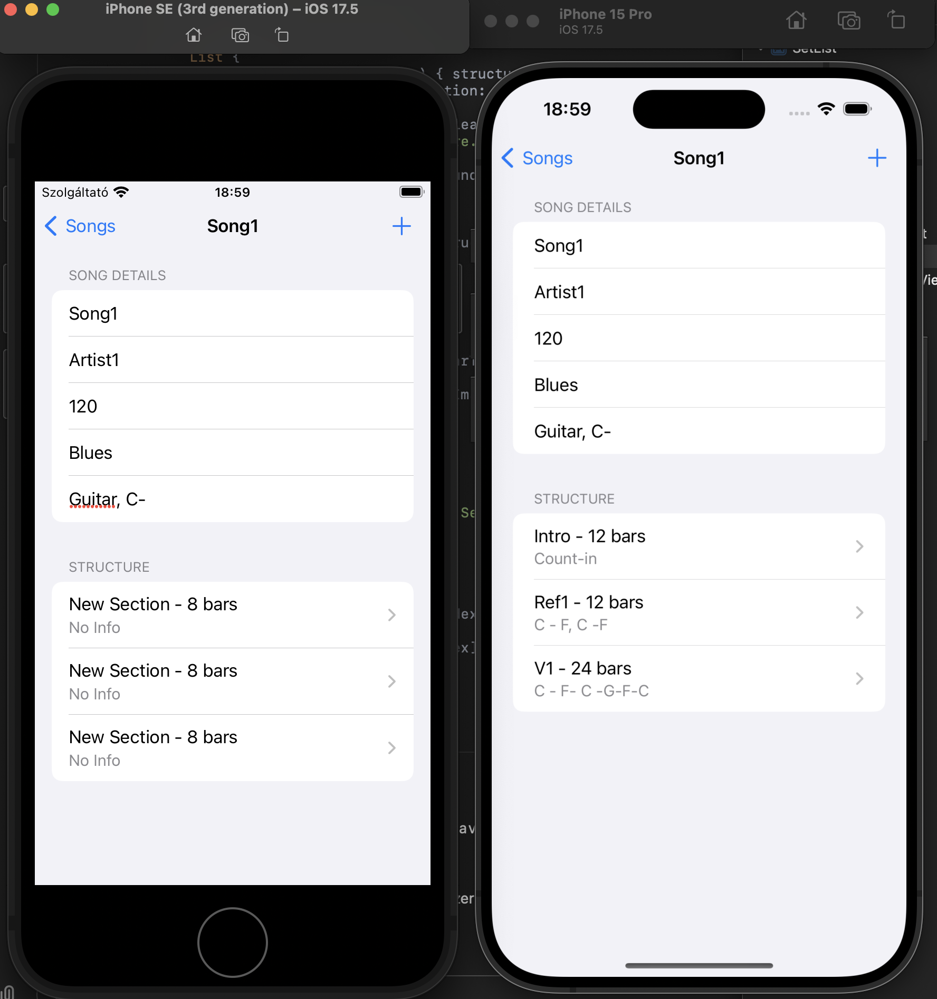

# Swift_SetList
Swift project for musicians to collect, edit setlists.

The actual state is very preliminary... Right now I just testing how core data, SwiftData and other backends are working, and what is supported by github CI without pain...

This branch actually tests, if latest framework and toolchain is available. (SwiftData requires macos v14) : looks OK
Unit Test was missing, therefore I added one. Lets see...

In the latest version: a Song-Structure (list of sections) can be added to each songs on the setlist...

